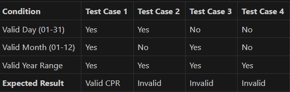
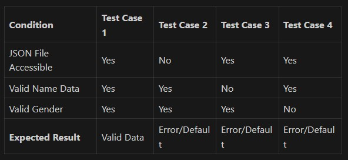

# Unit testing guidance — FakeInfo

This document explains how to apply black-box and white-box testing to the two unit tests in `tests/Unit/FakeInfoTest.php`:

- Return a fake CPR
- Return a fake first name, last name and gender

### 1) Return a fake CPR

Equivalence Partitioning:
- Valid partition: CPR format DDMMYYXXXX (10 digits)
- Invalid partitions: Wrong length, non-numeric characters, invalid dates

Boundary Value Analysis:
- Day: 01, 31 (valid boundaries), 00, 32 (invalid boundaries)
- Month: 01, 12 (valid boundaries), 00, 13 (invalid boundaries)
- Year: Based on your code (1900 to current year)

Decision Table Testing:


State Transition Testing:
- State 1: No CPR generated → Generate CPR → State 2: CPR exists
- State 2: CPR exists → Regenerate CPR → State 2: New CPR exists

### 2) Return a fake name and gender

Equivalence Partitioning:
- Valid partition: Names from JSON file, gender = 'male' or 'female'
- Invalid partitions: Empty names, invalid gender values, corrupted JSON

Boundary Value Analysis:
- JSON array bounds: First person (index 0), Last person (max index)
- Name length: Minimum 1 character, maximum reasonable length
- Gender values: Exactly 'male' or 'female'

Decision Table Testing:


State Transition Testing:
- State 1: No name/gender → Load from JSON → State 2: Name/gender assigned
- State 2: Name/gender exists → Regenerate → State 2: New name/gender assigned

---

## White Box Testing Techniques

White box testing examines the internal structure and implementation of the code. Here are the main techniques:

### 1. **Statement Coverage**
Ensure every line of code is executed at least once during testing.

### 2. **Branch Coverage (Decision Coverage)**
Test every decision point (if/else, switch cases) to ensure both true and false branches are executed.

### 3. **Path Coverage**
Test every possible execution path through the code, including all combinations of branches.

### 4. **Condition Coverage**
Test every individual condition in complex boolean expressions (AND, OR combinations).

### 5. **Loop Testing**
- **Zero iterations**: Skip the loop entirely
- **One iteration**: Execute loop body once
- **Multiple iterations**: Normal loop execution
- **Maximum iterations**: Test upper boundary
- **Maximum + 1**: Test what happens beyond limit

### 6. **Data Flow Testing**
Test the flow of data through variables:
- **Definition**: Where variables are assigned values
- **Use**: Where variables are read/used
- **Kill**: Where variables are reassigned or go out of scope

## Applied to Your Functions

### **Return a fake CPR (White Box)**

**Statement Coverage:**
- Test that all lines in `setCpr()` method are executed
- Test both gender branches (even/odd final digit logic)

**Branch Coverage:**
- Test when `birthDate` is not set (triggers `setBirthDate()`)
- Test when name/gender not set (triggers `setFullNameAndGender()`)
- Test both gender conditions for final digit (female=even, male=odd)

**Path Coverage:**
- Path 1: All data exists → Generate CPR directly
- Path 2: Missing birthDate → Generate birthDate → Generate CPR
- Path 3: Missing name/gender → Generate name/gender → Generate CPR
- Path 4: Missing both → Generate both → Generate CPR

**Loop Testing:**
- Test the random digit generation loop (3 random digits)

### **Return a fake name and gender (White Box)**

**Statement Coverage:**
- Test that all lines in `setFullNameAndGender()` are executed
- Test JSON file reading and parsing

**Branch Coverage:**
- Test successful JSON loading vs file not found
- Test valid JSON structure vs corrupted JSON
- Test array bounds (valid indices vs out of bounds)

**Path Coverage:**
- Path 1: JSON loads successfully → Extract random person → Set values
- Path 2: JSON fails to load → Handle error/fallback
- Path 3: JSON corrupted → Handle parsing error

**Data Flow Testing:**
- Track `$names` variable from file_get_contents → json_decode → array access
- Track `$person` from array selection → field extraction
- Track `firstName`, `lastName`, `gender` from assignment to return

White-box attention points:
- If first/last names are pulled from a data file, verify fallback behavior (no exception) when entries are missing
- If gender selection affects name formatting, test both branches if possible (mock randomness)

Edge cases:
- Non-ASCII characters in names should be handled (tests may assert string type and non-empty)
- Names with middle initials or punctuation — tests can assert that returned value is a string and not empty

---

## How to implement tests (examples)

Run unit tests folder:

```bash
cd backend
php ./vendor/bin/phpunit --configuration phpunit.xml --colors=always tests/Unit
```

Example PHPUnit assertions (pseudo-code that matches existing tests):

- CPR test (black-box):
```php
$output = $fakeInfo->getCpr();
$this->assertMatchesRegularExpression('/^\d{10}$/', $output);
// validate day/month if you want
$day = (int) substr($output, 0, 2);
$month = (int) substr($output, 2, 2);
$this->assertGreaterThanOrEqual(1, $day);
$this->assertLessThanOrEqual(31, $day);
$this->assertGreaterThanOrEqual(1, $month);
$this->assertLessThanOrEqual(12, $month);
```

- Name & gender test (black-box):
```php
$output = $fakeInfo->getFullNameAndGender();
$this->assertArrayHasKey('firstName', $output);
$this->assertArrayHasKey('lastName', $output);
$this->assertArrayHasKey('gender', $output);
$this->assertIsString($output['firstName']);
$this->assertNotEmpty($output['firstName']);
$this->assertIsString($output['lastName']);
$this->assertNotEmpty($output['lastName']);
$this->assertContains($output['gender'], ['male', 'female']);
```

### White Box Testing Implementation Examples

**Statement Coverage Test:**
```php
// Test that all lines in setCpr() are executed
public function testSetCprAllStatements(): void
{
    $mockFakeInfo = new MockFakeInfo();
    // Force different internal states to hit all statements
    $cpr1 = $mockFakeInfo->getCpr(); // Normal path
    $this->assertMatchesRegularExpression('/^\d{10}$/', $cpr1);
}
```

**Branch Coverage Test:**
```php
// Test both gender branches for CPR final digit
public function testCprFinalDigitByGender(): void
{
    $mockFakeInfo = new MockFakeInfo();
    
    // Test multiple generations to hit both gender branches
    for ($i = 0; $i < 20; $i++) {
        $result = $mockFakeInfo->getFullNameGenderAndCpr();
        $finalDigit = (int) substr($result['CPR'], -1);
        
        if ($result['gender'] === 'female') {
            $this->assertTrue($finalDigit % 2 === 0, 'Female CPR should end in even digit');
        } else {
            $this->assertTrue($finalDigit % 2 === 1, 'Male CPR should end in odd digit');
        }
    }
}
```

**Path Coverage Test:**
```php
// Test different execution paths through the code
public function testDifferentCodePaths(): void
{
    // Path 1: Test with mock that has predictable data
    $mockWithData = new MockFakeInfo();
    $result1 = $mockWithData->getCpr();
    
    // Path 2: Test error handling paths (if implemented)
    // This would require additional mocking or dependency injection
}
```

### Making tests deterministic (white-box / advanced)
Because the code likely uses randomness, white-box testing can make the tests deterministic:

- **Mock random functions**: Use `MockFakeInfo` to return predictable values instead of random ones
- **Dependency injection**: Extract random generation into injectable dependencies
- **Seed random generators**: Use `mt_srand()` with fixed seed for reproducible randomness
- **Test multiple iterations**: Run tests multiple times to ensure different random paths are covered

---

## Example test-driven checklist

- [ ] Ensure methods to test are `public` and return predictable types
- [ ] Add assertions that validate format and constraints (length, regex, allowed values)
- [ ] Avoid asserting exact random data values — assert structure and format
- [ ] When necessary, add mock classes to assert branches and fallback behavior

---

## Where to store these notes
Save this file under `backend/tests/Unit/README.md` (already created). Keep it updated as tests evolve.

If you'd like, I can also:
- Add example deterministic mocks and a couple of extra white-box tests
- Re-run unit tests and show the current coverage for these two test cases

Tell me which of these you'd like next.